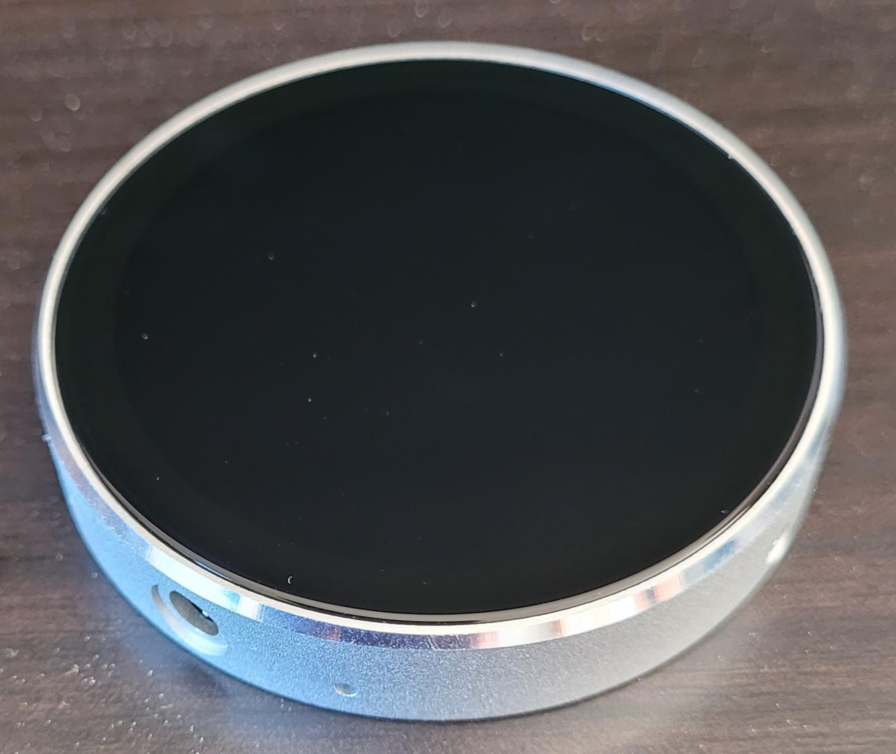
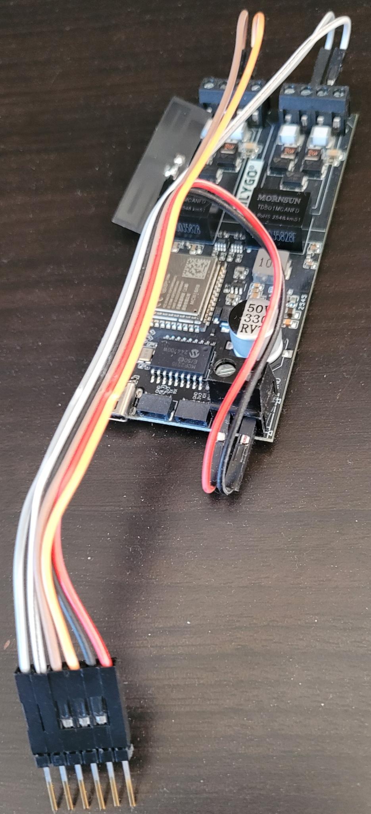
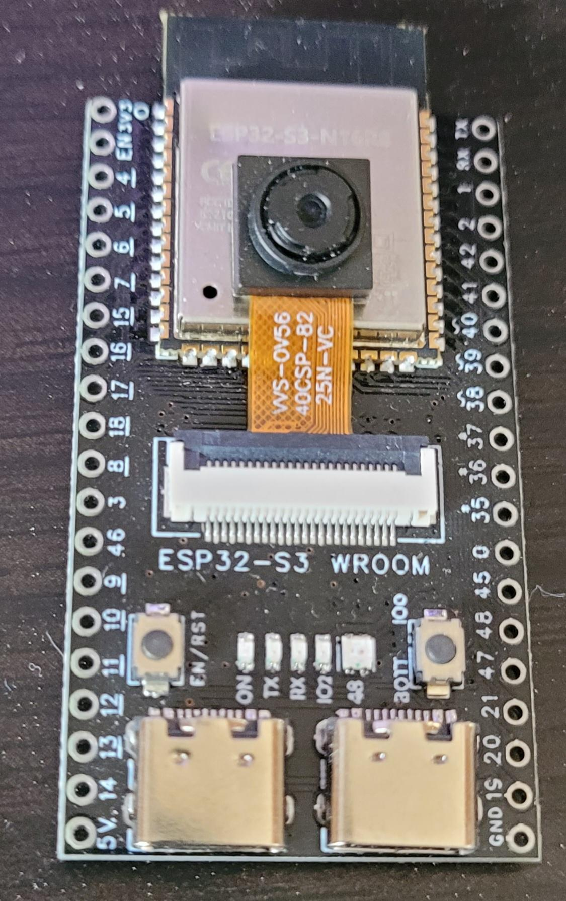
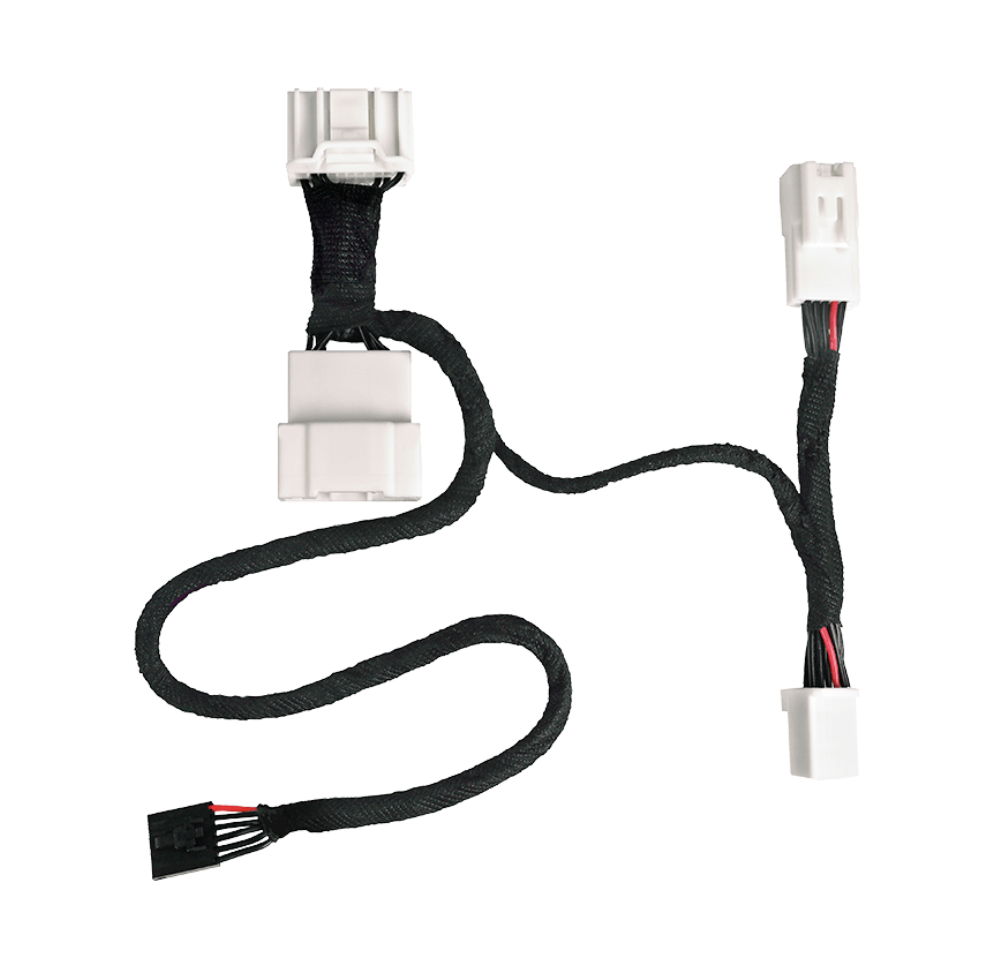
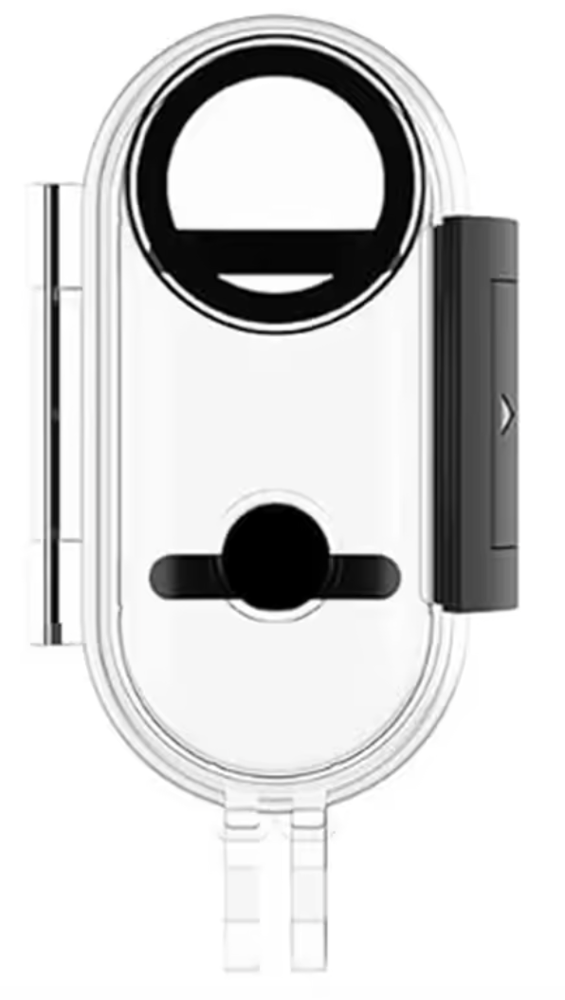

# TeslaCam

Dashboard embarqué sans fil pour Tesla Model 3, composé de trois modules ESP32-S3 indépendants qui communiquent entre eux sans aucun câblage dans l'habitacle.

## Présentation

TeslaCam transforme un petit écran rond de 3,6 cm en un tableau de bord auxiliaire complet pour Tesla Model 3. Le système lit en temps réel les données du bus CAN du véhicule (vitesse, batterie, autonomie, rapport engagé, puissance, températures, clignotants, angles morts, freinage…) et les affiche sur un écran circulaire haute résolution.

En touchant l'écran, le dashboard bascule sur le flux vidéo d'une caméra frontale sans fil, permettant une vue avant en temps réel.

### Fonctionnalités affichées

- **Vitesse** en temps réel (km/h)
- **Niveau de batterie** (SoC %) et autonomie restante (km)
- **Rapport engagé** (P, R, N, D)
- **Puissance moteur** instantanée (kW) — avant + arrière
- **Températures** : batterie, habitacle, extérieur
- **Heure** synchronisée depuis le véhicule
- **SoC à destination** estimé lors d'un itinéraire actif
- **Clignotants** avec halo lumineux animé (gauche, droite, warnings)
- **Alerte angle mort** avec indicateur visuel dédié
- **Indicateur de freinage** (halo rouge en bas de l'écran)
- **Caméra frontale** : flux vidéo JPEG en temps réel, activé par appui tactile sur l'écran

---

## Matériel nécessaire

Le projet utilise trois cartes ESP32-S3 et un câble de raccordement CAN. Coût total estimé : **~75 €**.

### 1. Écran — JC3636W518C

Carte ESP32-S3 intégrant un écran rond QSPI de 360×360 pixels (1,28 pouce). C'est le cœur du tableau de bord : il reçoit les données CAN et le flux caméra, et affiche l'ensemble sur son écran circulaire.

<p align="center">
  
</p>

| Caractéristique | Détail |
|---|---|
| Processeur | ESP32-S3 dual-core 240 MHz |
| Écran | ST77916 QSPI 360×360 rond |
| Flash / PSRAM | 16 MB / 8 MB OPI |
| Connectivité | Wi-Fi 2.4 GHz, Bluetooth 5, ESP-NOW |

**Acheter** : [AliExpress — JC3636W518C](https://www.aliexpress.com/w/wholesale-JC3636W518C.html) (~10-15 €)

---

### 2. Bridge CAN — LilyGo T-2CAN

Carte ESP32-S3 avec double contrôleur CAN bus intégré. Elle se connecte directement au bus CAN de la Tesla, filtre les trames utiles, et les transmet sans fil à l'écran.

<p align="center">
  
</p>

| Caractéristique | Détail |
|---|---|
| Processeur | ESP32-S3 dual-core 240 MHz |
| Bus CAN | 2× CAN (MCP2515 SPI + TWAI natif) |
| Flash / PSRAM | 16 MB / 8 MB |
| Alimentation | DC 5-12 V (directement sur le 12 V véhicule) |

**Acheter** : [AliExpress — LilyGo T-2CAN](https://www.aliexpress.com/w/wholesale-lilygo-t-2can.html) (~30 €)

---

### 3. Caméra — Freenove ESP32-S3 WROOM CAM

Carte ESP32-S3 avec capteur caméra OV5640 intégré. Installée à l'avant du véhicule, elle diffuse le flux vidéo en Wi-Fi vers l'écran lorsque l'utilisateur active le mode caméra par appui tactile.

<p align="center">
  
</p>

| Caractéristique | Détail |
|---|---|
| Processeur | ESP32-S3 dual-core 240 MHz |
| Caméra | OV5640 5 Mpx autofocus |
| Flash / PSRAM | 8 MB / 8 MB OPI |
| Connectivité | Wi-Fi SoftAP 2.4 GHz |

**Acheter** : [AliExpress — Freenove ESP32-S3 CAM](https://www.aliexpress.com/w/wholesale-freenove-esp32-s3-wroom-cam.html) (~15 €)

---

### 4. Câble CAN — Enhauto Cable Gen2

Câble de raccordement au port OBD du pilier A droit de la Tesla Model 3/Y. Il se branche en dérivation (pass-through) sur le connecteur d'usine et expose les lignes CAN H/L + alimentation 12 V pour le Bridge.

<p align="center">
  
</p>

| Caractéristique | Détail |
|---|---|
| Compatibilité | Tesla Model 3/Y (janvier 2021 – mars 2025, hors Juniper/Highland) |
| Installation | Port OBD pilier A droit (plug & play) |
| Sortie | CAN H/L + 12 V alimentation |

**Acheter** : [Enhauto — Cable Gen2 Model 3/Y Front](https://www.enhauto.com/products/cable-gen2-model-3-y-front-installation) (~16 €)

---

## Architecture globale

```
┌─────────────────────────┐
│    Tesla Model 3        │
│    Bus CAN (filaire)    │
└────────────┬────────────┘
             │
             │ CAN H / CAN L
             ▼
┌─────────────────────────┐
│   Bridge (T-2CAN)       │
│   Lecture + filtrage     │
│   des trames CAN        │
└────────────┬────────────┘
             │
             │ ESP-NOW (sans fil)
             ▼
┌─────────────────────────┐
│   Écran (JC3636W518C)   │
│   Dashboard rond 360×360│
│   Données + caméra      │
└────────────▲────────────┘
             │
             │ Wi-Fi UDP (sans fil)
             │
┌────────────┴────────────┐
│   Caméra (Freenove)     │
│   OV5640 JPEG stream    │
│   Activée par touch     │
└─────────────────────────┘
```

Aucun câble ne relie les trois modules entre eux. Seul le Bridge est connecté physiquement au bus CAN du véhicule.

---

## Évolutions futures

### Boîtier étanche pour la caméra

La caméra sera intégrée dans un boîtier étanche compact, permettant une installation discrète dans le pare-chocs avant du véhicule. L'objectif rond du boîtier s'aligne parfaitement avec l'optique de l'OV5640.

<p align="center">
  
</p>

**Boîtier** : [AliExpress — Boîtier étanche caméra](https://fr.aliexpress.com/item/1005005486360160.html) (~3 €)

### Nouvelles données affichées

De nombreuses informations supplémentaires pourront être ajoutées au dashboard grâce aux trames CAN déjà disponibles sur le bus :

- **Limite de vitesse** et alerte de dépassement
- **Autopilot / ACC** : état, vitesse de consigne, distance de suivi
- **Avertissements DAS** : collision frontale, sortie de voie, collision latérale
- **Préchauffage batterie** en cours
- **Alertes véhicule** : portes ouvertes, ceintures, phares

Le détail complet des fonctionnalités envisagées et des signaux CAN correspondants est décrit dans [IDEAS.md](IDEAS.md).
